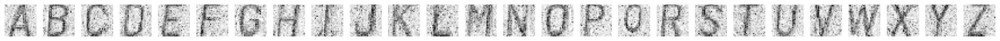
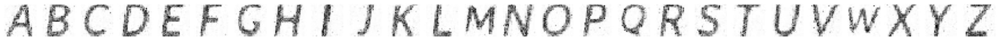
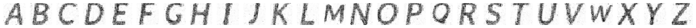
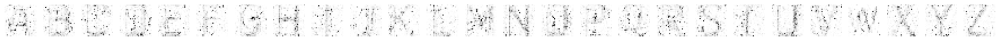
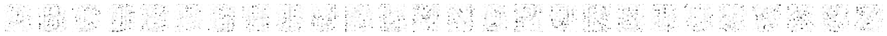
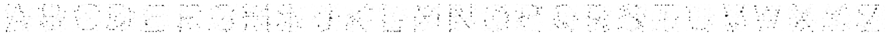
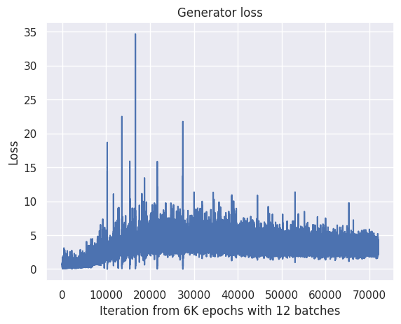
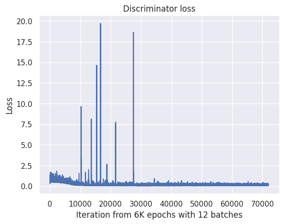

# Font creation using 2d GAN
* [kaggle](https://www.kaggle.com/code/faruanacabiano007/generative-adversarial-network)
* [wandb](https://wandb.ai/aadis-learning/font_creation?workspace=user-aadis-learning)

* [Colab](https://colab.research.google.com/drive/18jb0fVEMcdCxiET8rnFi40p3W7PJVz-5?usp=sharing)
* [nbviewer](https://nbviewer.org/github/AadityaSalgarkar/font_creation/blob/main/main.ipynb#)

## Goal
Main goal of this project is to generate new fonts using GANs.
The idea is to choose several images from the google fonts as a dataset, and train a GAN on it.

## Synthetic data generation
We use 746 google fonts to generate synthetic data.
Each font consists of 28x28 images of all 26 alphabets.

## Model
We train a GAN with 6000 epochs, described in the notebook.
We use the architecture from [this](https://github.com/eriklindernoren/PyTorch-GAN/blob/master/implementations/gan/gan.py) repository, and modify it to suit our needs.

## Result

Generated fonts at the end of 6000th epoch are shown in the notebook.

## Image result

## Losses

## Interesting runs

An interesting run where G loss went to 0:
[link](https://wandb.ai/aadis-learning/font_creation/reports/iconic-eon-2--Vmlldzo1ODc4MTM2?accessToken=d37pbr1ct8omrjxa3ydai5srugdcqg3ep67xr68dsvmy2re0473je00g5vggwbq4)

This indicates mode collapse, and would be interesting to investigate further.